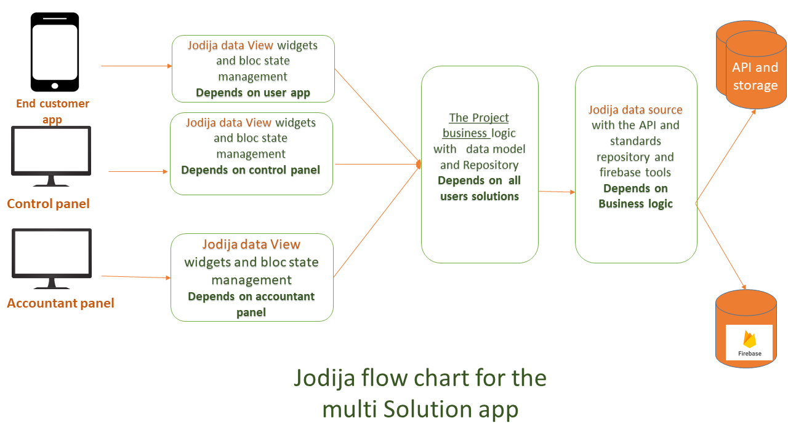

## Jodija Philosophy

As explained in the introduction, let's assume you have an application consisting of three sections, and this application is designed for a store. Therefore, the application will be structured as follows:

1. **Customer or User Application**: It doesn't have to be a mobile application; it can be a web browsing site or both.

2. **Store Control Panel**: It can be either web or mobile application, used to enter product data and receive delivery orders.

3. **Accounting and Inventory Section**: Since the sales section should be separate from the finance, accounting, and inventory sections, it must have its own section and dedicated application to handle its accounting issues such as managing ledgers, accounting cycles, inventory, etc.

Therefore, it is not feasible to have all these sections in one project. They should be in different and separate solutions to avoid affecting the application size and performance. Just as there is something known as microservices in the backend, there should be something known as multi-solution here.

So far, we have solved the issue of application size and performance. But how do the applications communicate with each other and handle data sources and APIs? Should each solution have its own data model and data repository, or should there be a business logic that unifies all data models in an independent solution?
Here, the idea of Jodija emerged to solve this problem as shown in the following diagram:

In the previous diagram, we saw how to solve the data path from interfaces to servers using the Jodija data view library and the Jodija data source library. Let's explain the role of each library in detail.
**1- Jodija Data Source Library**: It controls the management of the data path that we receive or send to servers via APIs or any server platforms like Firebase. It reforms the data according to the business logic to be displayed to the user if the data comes from the server or reformats it as JSON if sending it to servers.

**_How does the Data Source Library work?_**
The library is equipped with all the tools to assist in sending data to any server using `JoDijaHttpClient`, which is a class built on the `Dio` library. Through this class, we can send the required data to the server using any API, including sending any attached files. It also deals with Firebase through various classifications to facilitate working with Firebase.
These include `FirebaseLoadingData` for querying data from Firestore and other classifications that we will discuss in detail. It is better not to connect directly but to use a Repository, which will be detailed in the Jodija Data Source section.

**2- Jodija Data View Library**: This library controls managing the data path coming from the Data Source library or any Repository. It can either be formatted as JSON or as its own data model to be displayed to the user. It includes several input tools that assist developers in developing input interfaces such as text boxes, date pickers, and image files to be easily converted to JSON format. It also contains local storage tools and state management built on `cubit` and `provider`. Additionally, it includes project settings management to connect the project to any work environment and tools to make the project multilingual, among other great tools to facilitate the development of any project and ensure the code is smooth and clean. All these details are in the Data View section.

> [!IMPORTANT]
> Finally, we would like to clarify that if you are going to use several technologies other than Flutter for your project, for example, another web technology for the control panel and user web pages, and your project is for mobile applications, then this project is called One Solution. The libraries have been prepared for this task as well, with tools added to assist you in developing such a project.
