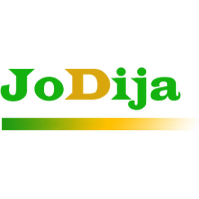

## Introduction to JOdija

 With the development of Flutter technology and the emergence of multiple platforms, we inevitably faced the problem of multiple interfaces and solutions, especially with large projects. Imagine you are designing a commercial project consisting of a dashboard, a website, a user application, and a seller application, as requested by the client. This application is scalable, so you need to modularize it to avoid increasing its size and complexity. Additionally, you must consider various interfaces and screen sizes for each interface, as well as connecting with APIs, Firebase, and other servers to link different parts of the application. All these issues led to the creation of Jodija.

## What is Jodija? 
It is comprised of two libraries that form a framework, each playing a role in managing the data flow from the interfaces to the servers. The two libraries are:

1-**Jodija data source**: It manages the data flow that we receive or send to servers via APIs or any server platform like Firebase. It reshapes the data to align with business logic for display to the user if the data is coming from the server, or formats it as JSON when sending it to the servers.

2-**Jodija data view**: It is a library that manages the data flow coming from the Data source library or any repository and is formatted either as JSON or as its specific data model to be displayed to the user. It includes several input tools that help developers create input interfaces such as text boxes, calendars, and image files to be easily converted to JSON format. It also includes local storage tools and has state management built on `Cubit` and `Provider`. It includes project settings management to link the project with any work environment and tools to make the project multilingual, among other great tools to facilitate the development of any project, ensuring the code is smooth and clean.

